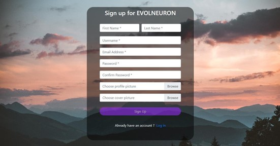
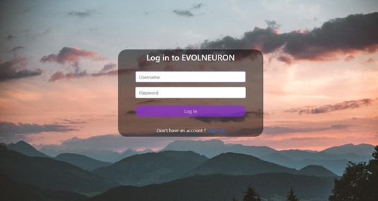
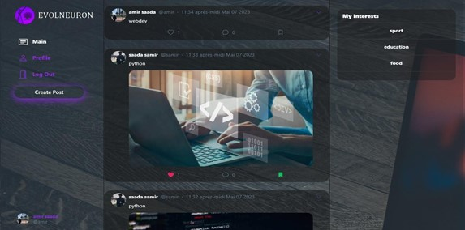
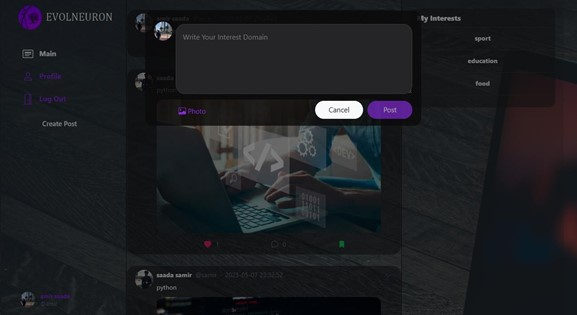
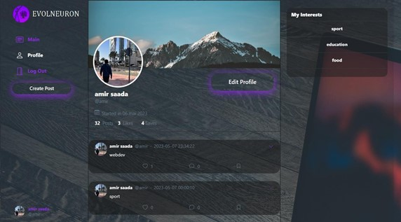
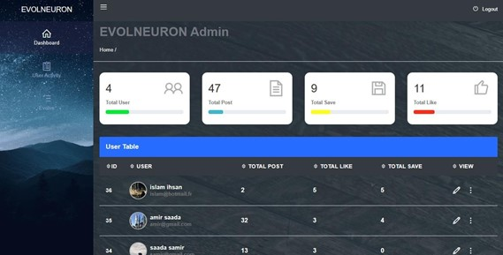
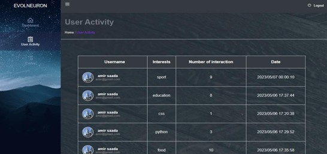
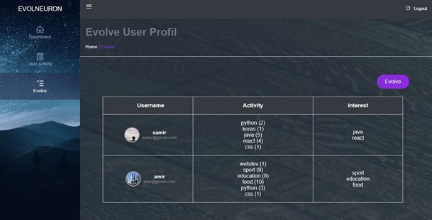

# Social Media Platform for Detecting User Interests Using CNN

A sophisticated social media platform that leverages Convolutional Neural Networks (CNN) to detect and evolve user interests based on their activities and posts.

## Table of Contents
- [Overview](#overview)
- [Features](#features)
- [Technology Stack](#technology-stack)
- [Screenshots](#screenshots)
- [Installation](#installation)
- [Usage](#usage)
- [Admin Dashboard](#admin-dashboard)

## Overview
This project implements a social networking platform that analyzes user behavior and content to automatically evolve user interests. Using machine learning techniques, particularly CNNs, the system processes user data to create enriched social profiles and provide personalized content recommendations.

### Key Objectives
- Leverage user data and social activities to evolve user interests
- Assist users in finding relevant content
- Enrich social profiles through automated analysis
- Support both active and passive user profiling

## Features
- User authentication (Sign up/Sign in)
- Social profile management
- Post creation and sharing
- Automated interest detection using CNN
- Interest evolution tracking
- Admin dashboard for profile management
- User activity monitoring

## Technology Stack
- **TensorFlow**: Open-source machine learning platform for implementing CNN
- **Python**: Primary programming language
- **Django**: Web framework following MVT architecture
- **SQLite**: Database management system
- **Additional Dependencies**: Listed in requirements.txt

## Screenshots

### Sign Up


### Sign In


### Home Page


### Post Creation


### Profile Page


### Admin Dashboard


### User Activity


### Profile Evolution



## Installation
1. Clone the repository:
    ```bash
    git clone https://github.com/yourusername/Social-Media-Platform-for-detecting-user-interests-using-CNN.git
    cd Social-Media-Platform-for-detecting-user-interests-using-CNN
    ```

2. Create and activate virtual environment:
    ```bash
    python -m venv venv
    source venv/bin/activate  # On Windows: venv\Scripts\activate
    ```

3. Install dependencies:
    ```bash
    pip install -r requirements.txt
    ```

4. Configure database:
    ```bash
    python manage.py makemigrations
    python manage.py migrate
    ```

5. Create superuser:
    ```bash
    python manage.py createsuperuser
    ```

6. Run the development server:
    ```bash
    python manage.py runserver
    ```

## Usage
1. Access the platform at `http://localhost:8000`
2. Create a new account or login with existing credentials
3. Complete your profile information
4. Start posting and interacting with content
5. View your evolving interest profile in the dashboard

## Admin Dashboard
Access the admin dashboard at `http://localhost:8000/admin` to:
- Manage user accounts
- Monitor user activities
- View interest evolution metrics
- Configure CNN parameters

